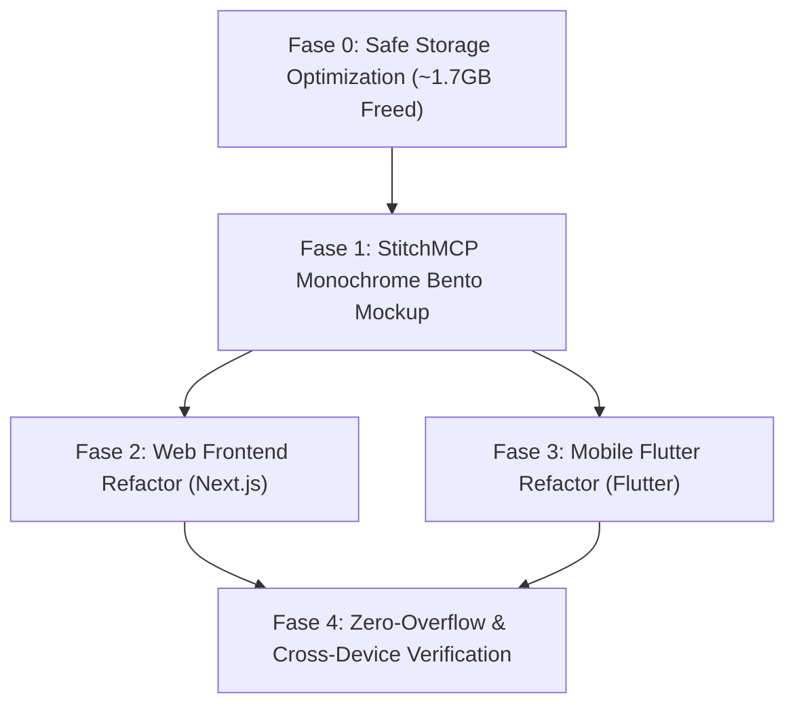

# Master Implementation Plan: Bento & Fluent Monochrome UI/UX, Zero-Overflow Responsiveness, Zero Backend Regression, & Storage Optimization

Rencana implementasi terpadu untuk merombak UI/UX platform **WhiteLabel (Web Next.js & Mobile Flutter)** menjadi **Sistem Monokrom Terang yang Elegan (Black, White & Zinc)** dengan pendekatan **Bento Grid UI**, **Fluent Design Tactility**, dan **Figma-grade Proportions**, tanpa mengubah atau merusak backend sama sekali, serta mengoptimalkan kapasitas storage proyek.

---

## 🛡️ Prinsip Utama & Jaminan Keamanan Sistem

1. **Zero Backend Impact Guarantee**:
   * Seluruh logika backend di `wl_backend/` (Express routes, Sequelize models, database migrations, WebSocket events, RabbitMQ consumers, authentication guards) **100% aman dan tidak diubah**.
   * Semua struktur payload request/response API pada frontend (`api.get`, `api.post`, dsb.) tetap mengikuti kontrak backend yang ada secara presisi.
2. **Zero-Overflow & Pixel-Perfect Responsiveness**:
   * Tidak ada bug horizontal overflow / scroll samping liar di seluruh rentang viewport ($375\text{px}$ iPhone SE, $390\text{px}-412\text{px}$ Android/iPhone, $768\text{px}-1024\text{px}$ iPad/Tablet, hingga $1440\text{px}+$ Desktop).
   * Penerapan strict containment: `min-w-0`, `max-w-full`, `break-words`, `overflow-x-auto` pada tabel data, dan tap target minimal $44\times44\text{px}$ untuk mobile touch ergonomics.
3. **Pembersihan Kapasitas Aman (Storage Optimization)**:
   * Menghapus cache build besar yang tidak diperlukan (~1.7+ GB) tanpa menyentuh file kode sumber, asset penting, migrasi, ataupun konfigurasi.

---

## 🎨 Konsep UI/UX: Bento Grid + Fluent + Figma-Grade Precision

```
┌──────────────────────────────────────────────────────────────────────────────────────────┐
│                                BENTO HERO GRID (12-Col)                                 │
├──────────────────────────────────────────┬───────────────────────────────┬───────────────┤
│  [COL 1-7: Interactive Stage & Seat Map] │ [COL 8-12: Live Dynamic Pass] │ [COL 1-12:    │
│  - Real-Time Seat Availability           │ - Dynamic QR Rotating Token   │  Key Stats &  │
│  - Category Filter Pill Switcher         │ - Perforated Ticket Cut-Out   │  Gate Latency │
│  - Tabular Pricing & Instant Hold        │ - One-Tap Apple/Google Wallet │  Sub-500ms]   │
└──────────────────────────────────────────┴───────────────────────────────┴───────────────┘
```

### 1. Karakteristik Desain:
* **Bento Grid Layout**: Pengelompokan informasi ke dalam modul-modul kartu asimetris yang dinamis dengan sudut melengkung halus (`rounded-2xl` / `16px`), border hairline zinc (`border border-zinc-200`), dan latar putih/off-white berlapis.
* **Fluent Design Tactility**: Tombol solid black dengan efek *light press*, focus rings kontras tinggi (`focus:ring-2 focus:ring-zinc-950 focus:ring-offset-2`), dan elevasi bayangan mikro (*subtle elevation*).
* **Figma Precision Typography**: Menggunakan **Plus Jakarta Sans** dengan hirarki skala yang proporsional, serta `font-mono tabular-nums` untuk perataan angka harga, kuota tiket, dan timestamp.
* **Monochrome Palette**:
  * Canvas: Zinc 50 (`#F8F9FA` / `#F4F4F5`)
  * Surface/Card: Pure White (`#FFFFFF`)
  * Primary Action / Text: Deep Zinc 950 (`#09090B`)
  * Muted Label: Zinc 500 (`#71717A`)
  * Hairline Border: Zinc 200 (`#E4E4E7`)

---

## 🧹 Fase 0: Optimasi Kapasitas & Pembersihan File (Safe Cleanup)

Berdasarkan audit kapasitas direktori proyek:

| Target Pembersihan | Ukuran Saat Ini | Kategori | Keamanan Hapus |
| :--- | :--- | :--- | :--- |
| `wl_mobile/build/` | **~1.34 GB** | Flutter Build Cache | **100% Aman** (Dibersihkan via `flutter clean`, dibuat ulang saat build) |
| `wl_frontend/.next/` | **~373 MB** | Next.js Build Cache | **100% Aman** (Dibersihkan & dibuild ulang secara fresh) |
| `wl_frontend/tsconfig.tsbuildinfo` | ~110 KB | TS Build Cache | **100% Aman** |
| `wl_backend/dist/` | ~1 MB | TS Output Cache | **100% Aman** (Otomatis dibuat saat `npm run build`) |
| `wl_mobile/.idea/` & `*.iml` | ~10 KB | IDE Cache | **100% Aman** |

> [!TIP]
> **Total Kapasitas yang Dihemat**: **~1.71 GB+** tanpa kehilangan 1 baris kode fungsional pun. File sumber, gambar, font, dan dependensi tetap utuh.

---

## 📋 Rencana Aksi Eksekusi



---

### Fase 1: StitchMCP — Setup Design System & Visual Generation

1. **Konfigurasi Design System di StitchMCP**:
   - `displayName`: "WhiteLabel Bento Monochrome"
   - `colorMode`: `LIGHT`
   - `customColor`: `#09090B` (Pitch Black)
   - `colorVariant`: `MONOCHROME`
   - `headlineFont`: `PLUS_JAKARTA_SANS`
   - `bodyFont`: `PLUS_JAKARTA_SANS`
   - `roundness`: `ROUND_TWELVE`

2. **Generate Screen Mockups**:
   - `LandingPage`: Bento hero grid, modular feature cards, clean monochrome event highlights.
   - `EventsCatalog`: Responsive filter bar, modular event cards dengan layout anti-overflow.
   - `OrganizerDashboard`: High-density Bento dashboard, tabular analytics, zero horizontal overflow.
   - `MobileNavbarDrawer`: Fullscreen slide-over drawer untuk navigasi HP.
   - `MobileScreens`: Gate Scanner, Adaptive Booth Cashier (Portrait & Landscape), Organizer Summary.

---

### Fase 2: Web Frontend — Bento Grid, Fluent Tactility, & Zero-Overflow

#### 1. Setup Global (Font & CSS Tokens)
- [MODIFY] [layout.tsx](file:///c:/OneDrive/Desktop/Arsa/UJIKOM/WhiteLabel/wl_frontend/app/layout.tsx):
  - Injeksi font `Plus_Jakarta_Sans` dari `next/font/google` dengan `--font-plus-jakarta-sans`.
  - Atur `body` className: `bg-[#F8F9FA] text-[#09090B] font-sans antialiased overflow-x-hidden min-h-screen`.
- [MODIFY] [globals.css](file:///c:/OneDrive/Desktop/Arsa/UJIKOM/WhiteLabel/wl_frontend/app/globals.css):
  - Perbarui token CSS `:root` ke Monochrome Light (Zinc-based).
  - Hapus utility dark mode lama dan ganti dengan utility Bento container & hairline borders.

#### 2. Navigasi Responsif & Mobile Drawer (Fix Kritis Navigasi)
- [MODIFY] [Navbar.tsx](file:///c:/OneDrive/Desktop/Arsa/UJIKOM/WhiteLabel/wl_frontend/src/components/Navbar.tsx):
  - Tambahkan tombol Hamburger Menu (`Menu` / `X`) untuk layar `md:hidden`.
  - Buat **Slide-Over Navigation Drawer** untuk mobile:
    - Navigasi lengkap (*Beranda, Catalog Event, My Tickets, Metode Pembayaran, Dashboard Organizer, Admin*).
    - Status User & Role Badge monokrom.
    - Tombol *Logout* dan *Google Sign In* yang mudah diakses satu tangan.
    - Backdrop blur lembut dengan auto-close saat rute berpindah.

#### 3. Redesign Halaman Utama & Storefront (Bento Grid Style)
- [MODIFY] [page.tsx (Landing)](file:///c:/OneDrive/Desktop/Arsa/UJIKOM/WhiteLabel/wl_frontend/app/page.tsx):
  - **Bento Hero Section**: Desain hero asimetris terang dengan kartu metrik modular, headline hitam tebal, dan tombol solid black ber-shadow mikro.
  - **Feature Bento Matrix**: 3 modul fitur unggulan berukuran asimetris dengan ikon monokrom tactile.
  - **Event Highlights**: Kartu event putih bersih dengan border zinc tipis, badge kategori monokrom, dan harga `font-mono tabular-nums`.
  - **Zero Overflow Guarantee**: Penggunaan `w-full max-w-7xl mx-auto px-4 sm:px-6 lg:px-8` tanpa fixed width kaku.
- [MODIFY] [events/page.tsx](file:///c:/OneDrive/Desktop/Arsa/UJIKOM/WhiteLabel/wl_frontend/app/events/page.tsx):
  - Search & filter bar bergaya Bento modular.
  - Grid responsif: 1 kolom (HP) $\rightarrow$ 2 kolom (Tablet) $\rightarrow$ 3 kolom (Desktop).
- [MODIFY] [event/[id]/page.tsx](file:///c:/OneDrive/Desktop/Arsa/UJIKOM/WhiteLabel/wl_frontend/app/event/[id]/page.tsx):
  - Layout 2-kolom desktop (Detail Event di kiri, Ticket Selector di kanan).
  - Di mobile (< 768px): Ticket Selector otomatis menjadi **Sticky Bottom Purchase Sheet** yang nyaman tanpa menghalangi konten.
- [MODIFY] [my-tickets/page.tsx](file:///c:/OneDrive/Desktop/Arsa/UJIKOM/WhiteLabel/wl_frontend/app/my-tickets/page.tsx):
  - Desain kartu tiket *perforated tear-off* putih dengan garis batas putus-putus dan QR code berkontras tinggi.

#### 4. Redesign Dashboard & Admin Pages
- [MODIFY] [dashboard/page.tsx](file:///c:/OneDrive/Desktop/Arsa/UJIKOM/WhiteLabel/wl_frontend/app/dashboard/page.tsx):
  - Bento KPI Grid: 4 modul metrik dengan visual hierarchy yang seimbang.
  - Tabel data responsif dengan wrapper `overflow-x-auto` agar tidak terjadi overflow di HP.
- [MODIFY] [dashboard/promos/page.tsx](file:///c:/OneDrive/Desktop/Arsa/UJIKOM/WhiteLabel/wl_frontend/app/dashboard/promos/page.tsx):
  - Konversi penuh dari dark ke clean monochrome dashboard table.
- [MODIFY] [dashboard/events/page.tsx](file:///c:/OneDrive/Desktop/Arsa/UJIKOM/WhiteLabel/wl_frontend/app/dashboard/events/page.tsx), [payouts/page.tsx](file:///c:/OneDrive/Desktop/Arsa/UJIKOM/WhiteLabel/wl_frontend/app/dashboard/payouts/page.tsx), [staff/page.tsx](file:///c:/OneDrive/Desktop/Arsa/UJIKOM/WhiteLabel/wl_frontend/app/dashboard/staff/page.tsx), [refunds/page.tsx](file:///c:/OneDrive/Desktop/Arsa/UJIKOM/WhiteLabel/wl_frontend/app/dashboard/refunds/page.tsx):
  - Penyelarasan tema monokrom terang dan wrapping anti-overflow pada semua tabel & form.
- [MODIFY] [booth/page.tsx](file:///c:/OneDrive/Desktop/Arsa/UJIKOM/WhiteLabel/wl_frontend/app/booth/page.tsx):
  - Kasir POS web monokrom responsif.

---

### Fase 3: Mobile Flutter — Light Bento Theme, Adaptive Layout, & GPU Optimization

#### 1. Core Theme & Typography Monokrom
- [MODIFY] [app_theme.dart](file:///c:/OneDrive/Desktop/Arsa/UJIKOM/WhiteLabel/wl_mobile/lib/core/theme/app_theme.dart):
  - Ganti `darkTheme` menjadi `lightTheme`:
    - `scaffoldBackgroundColor`: `Color(0xFFF8F9FA)` (Zinc 50)
    - `primaryColor`: `Color(0xFF09090B)` (Deep Zinc 950)
    - `cardColor`: `Colors.white` dengan border `Color(0xFFE4E4E7)`
    - `ElevatedButton`: Solid black button dengan border radius `12px` dan teks putih tebal.
    - `InputDecoration`: Background abu-abu muda (`0xFFF4F4F5`) dengan border hairline zinc.
  - Konfigurasi `TextTheme` dengan font Plus Jakarta Sans.
- [MODIFY] [main.dart](file:///c:/OneDrive/Desktop/Arsa/UJIKOM/WhiteLabel/wl_mobile/lib/main.dart):
  - Set `theme: AppTheme.lightTheme`.

#### 2. Adaptive Responsiveness & Mobile Features
- [MODIFY] [booth_cashier_view.dart](file:///c:/OneDrive/Desktop/Arsa/UJIKOM/WhiteLabel/wl_mobile/lib/features/booth/presentation/views/booth_cashier_view.dart):
  - **Adaptive Layout via `LayoutBuilder`**:
    - **HP Portrait (Vertikal)**: Amount Display & Numpad di atas, Riwayat Transaksi di collapsible bottom sheet / tab view (bebas overflow).
    - **HP Landscape & Tablet**: Split-view 2-kolom (Numpad di kiri, Riwayat Transaksi di kanan).
  - Numpad putih tactile dengan border abu-abu dan teks angka hitam tebal.
- [MODIFY] [login_view.dart](file:///c:/OneDrive/Desktop/Arsa/UJIKOM/WhiteLabel/wl_mobile/lib/features/auth/presentation/views/login_view.dart):
  - Clean monochrome login card dengan tenant switcher yang rapi.
- [MODIFY] [gate_scanner_view.dart](file:///c:/OneDrive/Desktop/Arsa/UJIKOM/WhiteLabel/wl_mobile/lib/features/gate/presentation/views/gate_scanner_view.dart):
  - Pasang `RepaintBoundary` pada camera viewport untuk rendering 60 FPS tanpa beban CPU berlebih.
  - Stats pills monokrom di AppBar putih dan daftar log scan ber-border bersih.
- [MODIFY] [organizer_summary_view.dart](file:///c:/OneDrive/Desktop/Arsa/UJIKOM/WhiteLabel/wl_mobile/lib/features/organizer/presentation/views/organizer_summary_view.dart):
  - Bento KPI cards monokrom dan bar progress yang proporsional di seluruh ukuran layar.
- [MODIFY] [tenant_select_view.dart](file:///c:/OneDrive/Desktop/Arsa/UJIKOM/WhiteLabel/wl_mobile/lib/features/auth/presentation/views/tenant_select_view.dart):
  - Penyelarasan ke light theme.

---

## 🔍 Rencana Verifikasi, Uji Overflow, & Kompilasi

### 1. Eksekusi Pembersihan & Verifikasi Build
```bash
# 1. Bersihkan build cache mobile (menghemat ~1.34 GB)
cd wl_mobile && flutter clean && flutter pub get

# 2. Analisis kode Flutter (Zero errors)
flutter analyze

# 3. Bersihkan & Build Frontend Next.js (Zero TypeScript / build errors)
cd ../wl_frontend && npm run build
```

### 2. Uji Bebas Overflow (Zero-Overflow Matrix)
* **Mobile Viewport ($375\text{px}$ & $390\text{px}$)**:
  * Verifikasi `document.documentElement.scrollWidth === window.innerWidth` (tidak ada horizontal scrollbar liar).
  * Drawer navigasi mobile terbuka dan tertutup dengan lancar.
* **Tablet Viewport ($768\text{px} - 1024\text{px}$)**:
  * Grid Bento bertransformasi proporsional dari 1 kolom ke 2 kolom.
* **Mobile App Rotation**:
  * Rotasi HP dari portrait ke landscape pada Booth Cashier beralih tata letak secara instan tanpa warning `RenderFlex overflowed`.

### 3. Jaminan Integritas Backend
* Menjalankan tes konektivitas API publik dan autentikasi untuk memastikan semua request/response payload tetap berfungsi 100% normal.
